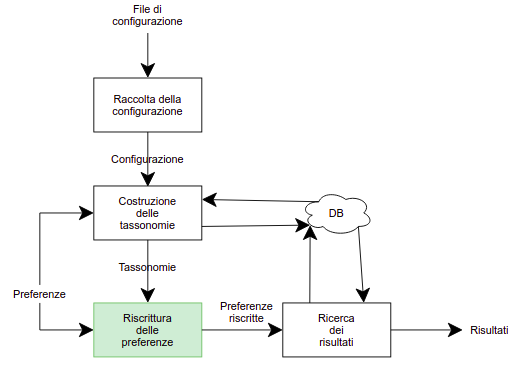

# QuerysuDominiTassonomici
Codice da me sviluppato nello svolgimento della mia tesi triennale

l'obiettivo è stato quello di sviluppare codice attorno a un motore di riscrittura di query, come mostrato nell'immagine in alto.
Il codice del motore (scritto dal prof Davide Martinenghi) non mi appartiene ma intanto pubblico ciò che ho fatto io.

